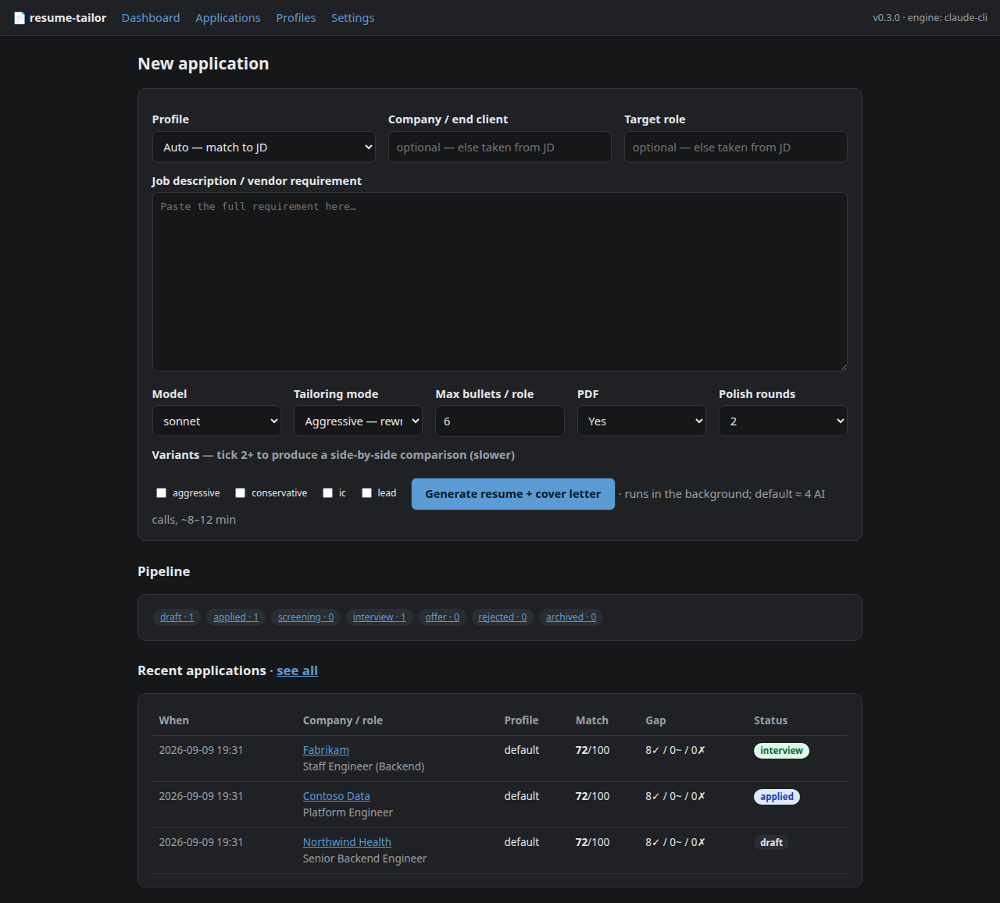
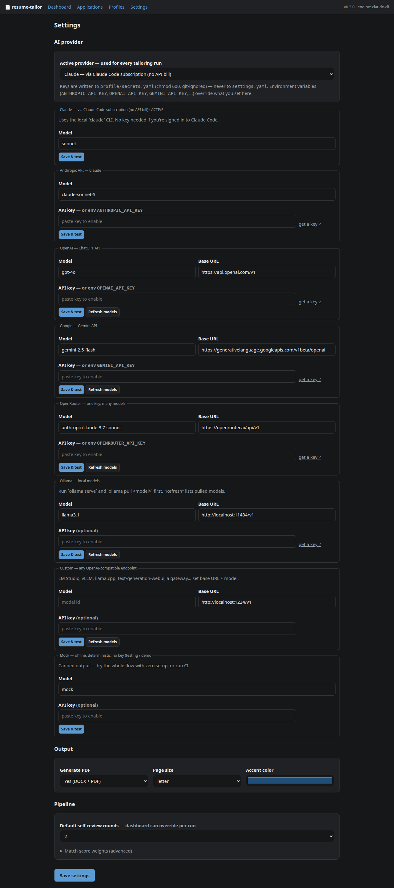

# resume-tailor

Turn a job description into a **fully tailored resume + cover letter**, in **DOCX
and PDF**, with a **skills-gap report and a 0–100 match score** — while keeping
your **clients, employers, locations and work durations locked** so they can
never drift.

Every run rewrites the professional summary, the ordering of your skills, and the
project context + bullets of *every* engagement so the technologies and
responsibilities the job asks for sit front and centre — then force-reverts the
client names and start/end dates from your master profile.

- **CLI + local web app** with an application tracker (every run saved, status,
  notes, match/coverage view, re-render).
- **Any AI provider** — Claude Code subscription, Anthropic / OpenAI / Gemini /
  OpenRouter API, or a **local model** (Ollama, LM Studio, llama.cpp, …). Pick it
  on the Settings tab.
- **Multiple master profiles** (e.g. Backend vs Data vs Platform); "Auto" routes a
  JD to the best-fitting one by required years + role.
- Optional one-box **Proxmox LXC + Tailscale** self-host — [`deploy/DEPLOY.md`](deploy/DEPLOY.md).

<p align="center">
  
</p>

## Quickstart

```bash
pip install -e .                 # from a clone;  or: ./setup.sh
resume-tailor init               # scaffolds profile/ + settings.yaml

# try it right now, no API key, no network:
resume-tailor tailor --engine mock --jd examples/sample_job.txt

$EDITOR profile/profiles/default/master_profile.yaml   # your real resume, once
resume-tailor web                # http://127.0.0.1:8000  → Settings tab picks the provider
```

Python 3.11+. LibreOffice is optional (pixel-faithful PDF from the DOCX); without
it, a built-in renderer mirrors the layout.

### With Docker

```bash
docker compose up --build        # http://127.0.0.1:8000 , data in ./rt-data
```

The container can't use the `claude-cli` provider — set an API key in `.env`
(see `.env.example`) or open the Settings tab and pick one.

## AI providers

| provider | key env | notes |
|---|---|---|
| `claude-cli` | — | local `claude` CLI / Claude Code subscription — **no API bill** (default) |
| `anthropic` | `ANTHROPIC_API_KEY` | native Claude API — `pip install '.[api]'` |
| `openai` | `OPENAI_API_KEY` | ChatGPT API |
| `gemini` | `GEMINI_API_KEY` | Google Gemini (via its OpenAI-compatible endpoint) |
| `openrouter` | `OPENROUTER_API_KEY` | one key, hundreds of models |
| `ollama` | — | local models — `ollama serve` + `ollama pull …` |
| `custom` | optional | any OpenAI-compatible URL: LM Studio, vLLM, llama.cpp, a gateway |
| `mock` | — | offline, deterministic, canned output — for a demo or CI |

Everything except `claude-cli` and `anthropic` goes through one small stdlib
OpenAI-compatible client — no extra packages. Keys live in `profile/secrets.yaml`
(chmod 600, git-ignored) or an env var (which wins), **never** in `settings.yaml`.
`resume-tailor engines` shows what's configured.

## CLI

```bash
resume-tailor tailor --jd job.txt --company "Acme" --role "Senior Java Engineer"
pbpaste | resume-tailor tailor                 # JD on stdin
resume-tailor tailor --jd job.txt --engine openai --model gpt-4o
resume-tailor gap --jd job.txt                 # gap report only, no documents
resume-tailor web                              # dashboard + tracker
resume-tailor engines / models / profiles      # what's configured
```

## Where your data lives

Under the current directory (or `$RESUME_TAILOR_HOME`): `profile/` (your master
profiles + `settings.yaml`), `data/applications.db` (the tracker), `outputs/`
(one folder per run). None of it is committed.

## Privacy

Your JD **and** the relevant parts of your master profile are sent to whichever
provider you pick. `claude-cli` and `ollama`/`custom` (a local model) keep that on
your machine / subscription; the hosted APIs send it to that vendor. `mock` sends
nothing.

### Profile library + JD auto-routing

Keep one profile per target role/seniority. Manage them in the web UI (**Profiles** →
create / clone / edit — a structured form, no YAML), or from the CLI:

```bash
resume-tailor profile new ai-engineer --from default
resume-tailor profile set ai-engineer --years 7 --role-family "ai engineer,llm,ml" --label "Senior AI Engineer"
resume-tailor profiles                   # list them
resume-tailor tailor -p auto --jd job.txt   # routes by the JD's required years + role
```

Each profile carries its own **declared years of experience**, **role family**, and **section
layout** (which sections, order, headings, per-section `max` items, plus `custom:` sections that
print verbatim). On the dashboard, **Auto** (the default) reads the JD's `min_years` + role and
picks the profile that fits — a 5-year JD lands on your 6-year profile, a 7-year JD on your
senior one. A profile left on the default five sections behaves exactly as before.

### Application tracker

Every `tailor` run is recorded in `data/applications.db` (SQLite).

```bash
resume-tailor apps list [--status applied] [--profile ai-engineer]
resume-tailor apps show <id>
resume-tailor apps set-status <id> interview      # draft|applied|screening|interview|offer|rejected|archived
resume-tailor apps note <id> "recruiter call 9/12"
```

The web app (`resume-tailor web`) is the friendlier view: submit a JD, watch the
job run live, download the files, read the match score + coverage map, set status,
keep notes, re-render.

### How a run works

`extract requirements → gap analysis → draft resume+cover letter → self-critique &
revise ×N → deterministic coverage + match score → render`. The requirement
extraction ranks each must-have by **prominence**, pulls **verbatim ATS keywords**,
**hard gates** (exact years, clearance, cert) and a **role archetype**. Every
tailored bullet is tagged with the master material it came from — or `stretch` if
aggressive mode added it. `review_rounds` (default **2**, `--review-rounds` /
dashboard override, `0` = classic single draft) is how many critique/revise passes
run. **Variants** (`--variants aggressive,conservative,ic,lead` or the dashboard
checkboxes) produce each angle in its own subfolder plus a `comparison.md` and a
recommendation; the app can "promote" the one you pick.

### Output

Each run creates `outputs/<company>_<role>_<date>/`:

| file | what |
|---|---|
| `resume.docx` / `resume.pdf` | tailored resume, standard layout |
| `cover_letter.docx` / `cover_letter.pdf` | "why I fit this requirement" write-up |
| `match.md` / `match.json` | 0–100 fit score, component breakdown, concrete "what's weak" list |
| `coverage.md` / `coverage.json` | per must-have: is it in the summary / skills / a bullet; hard-gate verdicts; every `stretch` bullet |
| `gap_report.md` | matched / partial / **missing** skills + required-vs-available years |
| `comparison.md` | only with `--variants`: the angles side by side + a recommendation |
| `tailored_profile.yaml` | the structured tailored content (bullets carry their `source`) — hand-edit and re-render |
| `requirements.json` | what the AI extracted from the JD (ranked skills, ATS keywords, gates, archetype) |
| `job.txt` | the JD you fed in |
| `warnings.txt` | anything the invariant-lock had to correct |
| `<angle>/…` | with `--variants`: a full set per angle |

Edit `tailored_profile.yaml` and regenerate the documents without another AI call:

```bash
resume-tailor render outputs/acme_senior-java-engineer_2026-09-08/tailored_profile.yaml
```

## The master profile

`profile/profiles/<name>/master_profile.yaml` is your single source of truth
(a legacy single `profile/master_profile.yaml` is auto-migrated to
`profiles/default/` on `init`).

- **Locked every run:** each experience entry's `client`, `employer`, `location`,
  `start`, `end`.
- **Rewritten every run:** `summary`, `skill_groups` (and their order), each
  entry's `role` wording, `summary` line and `bullets`.
- Put *everything* you have ever worked with into `skill_groups`, each entry's
  `environment`, and `bullet_library`. The richer it is, the better the result.

### Tailoring modes

- default (**aggressive**): projects are rewritten to match the JD; skills the JD
  wants that aren't in your profile are woven into plausible points in your real
  timeline. Review `gap_report.md` — the `missing` list tells you what was added
  beyond what your profile documented.
- `--conservative`: only rephrases and reorders experience you actually listed;
  missing skills are left out.

## Settings

Edit them on the web **Settings** tab, or in `profile/settings.yaml` (every key is
documented in [`settings.example.yaml`](src/resume_tailor/data/settings.example.yaml)):
active provider, per-provider model + base URL, `make_pdf`, `page_size`
(`letter`/`a4`), `accent_color`, default `review_rounds`, match-score weights.
Env overrides: `RESUME_TAILOR_ENGINE`, `RESUME_TAILOR_MODEL`, `RESUME_TAILOR_HOME`.

<p align="center">
  
</p>

API keys entered here are written to `profile/secrets.yaml` (chmod 600,
git-ignored) — never to `settings.yaml`; an env var always overrides. **Save &
test** does a one-token call against the provider; **Refresh models** lists what a
local server (Ollama, LM Studio, …) actually has pulled.

### Model

For `claude-cli` the aliases `opus` / `sonnet` (default) / `haiku` trade quality
for speed/cost and map to the right id per provider; any other value (a full model
id, `sonnet[1m]`, …) passes straight through. `resume-tailor models` lists them.
Override one run with `--model opus` or the dashboard's **Model** dropdown (your
pick is remembered). For the other providers, set the model on the Settings tab.

## Self-host

For most people `docker compose up` or `pip install` + `resume-tailor web` behind
your own reverse proxy is enough. [`deploy/DEPLOY.md`](deploy/DEPLOY.md) is the
author's specific setup — a **Proxmox LXC reachable only on a Tailscale tailnet**,
systemd service, HTTPS via `tailscale serve`, headless `claude` token so there's
still no API bill. It's one example, not a requirement.

## Development

```bash
pip install -e ".[api,dev]"
pytest            # fully offline via the `mock` engine
ruff check .
```

## Layout / format

The DOCX is built to one fixed structure: centered name + title + contact line,
then Professional Summary, Technical Skills, Professional Experience
(client — vendor, role | location, date range, bullets), Education, Certifications.
Tune fonts/spacing/heading rules in `src/resume_tailor/render_docx.py`; the PDF
fallback in `render_pdf.py` mirrors the same layout. If you have a required
house template, share it and it can be wired in as the renderer.
